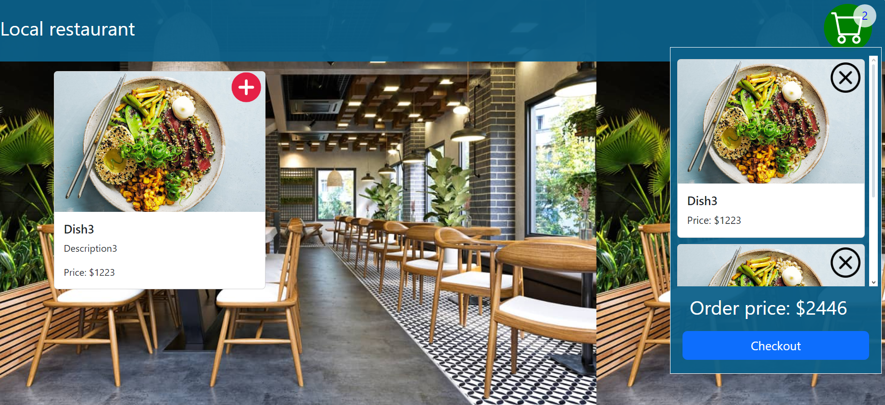

# CapstoneProject
This project is software platform for restaurants or cafés that allows integrating online functions into business processes.

## Setup
Setuping of project needs to install MySQL database and deploy content of project into the target folder.

## Run
Running of project needs to launch npm start

## Branching strategy
This project had been developed by strategy of developemnt user interface in branch [dev_managment](https://github.com/EvgenyPereguda/CapstoneProject/tree/dev_managment) and code for quering to database in branch [dev_database](https://github.com/EvgenyPereguda/CapstoneProject/tree/dev_database)
Stripe api quering[dev_stripe](https://github.com/EvgenyPereguda/CapstoneProject/tree/dev_stripe)    
 